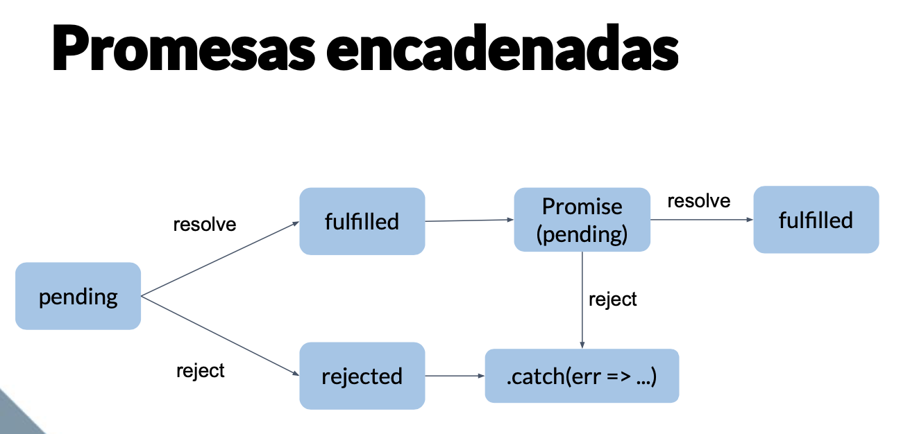

# Asincronismo en Javascript

En este blog explicaré todos os términos que se usan para explicar el asincronismo en Javascript. Esperando ayudar algunos desarrolladores a entender como es que funciona el asincronismo en javascript y el event loop. Esto es basado en el curso de Asincronismo de Platzi 💚.

Primero a javascript se le conoce como un lenguaje de programación basado un modelo **concurrente** y **no bloqueante** con un manejador de eventos *(Event Loop)* de un único hilo *(thread)* que nos permite realizar tareas de manera asíncrona.

## Contenido

1. [Concurrencia y Paralelismo](#concurrencia-y-paralelismo)
2. [Operaciones CPU Bound y I/0 Bound](#operaciones-cpu-bound-e-i/o-bound)
3. [Síncrono y Asíncrono](#síncrono-y-asíncrono)
4. [Como funciona el event loop](#como-funciona-el-event-loop)
  - [Event Loop](#event-loop)
  - [Call Stack](#call-stack)
  - [Web APIS](#web-apis)
  - [Callback Queue (Task Queue)](#callback-queue)
5. [Callback](#callback)
6. [Promise](#promise)
7. [Async / Await](#async/await)
8. [Cuando usar Callbacks, Promises o Async / Await](#cuando-usar-callbacks,-promises-o-async-/-await)
9. [Referencias](#referencias)

## Concurrencia y Paralelismo

* **Concurrencia:** Cuando dos o más tareas progresan simultáneamente

* **Paralelismo:** Cuando dos o más tareas se ejecutan en el mismo instante de tiempo.

La diferencia entre concurrencia y paralelismo, que varias tareas **progresan simultáneamente**, no significa que sucedan al mismo tiempo.

Pongamos un caso, tu tienes que realizar una presentanción pero te demoras 3 horas en tomar el tren de tu casa al trabajo y otras 4 horas en hacer la presentación.

Si lo trabajarás de **manera secuencial**, tendrías que ir al trabajo, lo cúal significa pasar 3 horas en el transporte y luego otras 4 horas en la presentación. Lo cúal da un total de 7 horas.

Si lo trabajarás de **manera concurrente**, a pesar de que estás en el transporte, también puedes ir avanzando tu presentación mientras llegas al trabajo. Notarás que los dos procesos no son interrumpidos y que ambas son realizadas por una sola persona.

Finalmente si fuera de **manera paralela**, Podrías ir avanzando tu presentación mientras llegas al trabajo y pedir a un amigo que te ayude a avanzar tu presentación. En este caso un proceso fue desarrollado por dos personas.

Podemos decir que la concurrencia ejecuta tareas que progresan simultáneamente y de forma independiente. Mientras que el paralelismo es un sub-caso dentro de la concurrencia, donde las tareas suceden exactamente al mismo tiempo gracias a que cuenta con más ejecutores.

En el caso de la concurrencia no necesita más de un hilo(*hilo o thread* es el que se encarga de ejecutar el programa). Lo que hace es dividir los procesos en tareas más pequeñas y cada una se ejecuta durante un breve momento, y así ambos procesos dan la impresión de que todas progresan al mismo tiempo.


## Operaciones CPU-Bound e I/O Bound

Dentro de nuestra aplicación podemos encontras tareas que consumen los recursos de nuestra CPU. Estas se las conoce como operaciones *CPU-Bound*.

Sin embargo, es frecuente encontrar otro tipo de operaciones, por ejemplo: acceder a los datos de un servidor externo, consultar datos de una base de datos externa o leer archivos de tu disco duro. Todas estas operaciones de entrada/salida son peticiones que *estan fuera del contexto de nuestra aplicación* ya que lo encargados de completar estas operaciones son los servidores o los sistemas operativos.


La forma en la que se ejecutan los *CPU-Bound son de manera síncrona*( secuencial, si la CPU esta ocupada no puede ejecutar otra tarea hasta que se libre) y en el caso de *los I/O Bound pueden ser de manera asíncrona*. Lo explicaré en la siguiente sección.


## Síncrono y Asíncrono

Las operaciones I/O Bound tienen dos fases: La primera es la de espera de que los datos esten disponibles y la última es la de ejecución, que es lo que se hará con los datos obtenidos.

Síncrono y Asíncrono hacen referencia a estas dos fases y como es que afecta nuestro programa.

* **Síncrono (Bloqueante):** Una operación bloqueante no devuelve el control a nuestra aplicación hasta que se haya completado. Esto significa que el thread queda bloqueado en estado de espera.

* **Asíncronas (No Bloqueante):** Es una operación devuelve inmediatamente el control a nuestra aplicación independientemente de que si se haya completado la operación o no. En caso se haya completado, se devolverá los datos solicitados y se procesará en algún momento futuro. En caso contrario podría devolver un mensaje de error o que los datos aún no estan disponibles.


## Como funciona el event loop

Como lo mencioné anteriormente Javascript es un lenguaje de programación de **un solo hilo (thread)**, eso quiere decir que solo puede ejecutar una cosa a la vez. Además, tenemos el Runtime como por ejemplo el V8 de Google, este motor se usa en Chrome y NodeJS. El motor consta de dos componentes principales


* **Memory Heap** Es el espacio en memoria compartido para toda nuestra aplicación donde se guarda información de las variables y el scope. Cuenta con un recolector de basura que se encarga de liberar aquello que no necesita.

* **Call Stack** Como su nombre lo dice es una Pila de ejecución que tiene el modelo *LIFO (Last In, First Out)*.

Nos enfocaremos en el Call Stack, que a partir de aquí entenderemos como funciona el Event Loop.

### Call Stack

Esta estructura de datos, similar al arreglo solo puede agregar elementos al final (push) y remover el último elemento (pop).

El proceso que realiza es poner las llamadas a funciones según el orden de ejecución de nuestro programa. Si la función llama a su vez, a otra función, es agregada al call stack. En caso suceda un error, esto se imprimirá en consola el estado del call stack al momento en que ocurrió.

Javascript como tiene un solo hilo, eso quiere decir que solo se ejecutará el código por ese único thread y solo cuenta con un call stack.

Veamos un ejemplo:

```js
  function segundoFrame() {
    var foo = 20 * 100;
    return foo;
  }

  function primerFrame() {
    var bar = 5;
    var foo = segundoFrame();

    console.log(bar + foo);
  }

  primerFrame();
```

1. Cuando llamamos `primerFrame` un primer frame es creado, conteniendo los argumentos de `primerFrame` y todas sus variables locales.

2. Cuando `primerFrame` llama a la función `segundoFrame` se crea un segundo frame y es agregado al comienzo(top) del stack conteniendo los argumentos y variables locales de `segundoFrame`.

3. Como ya no se llama ninguna otra función, la función `segundoFrame` se ejecutará y retornará lo que le corresponde. Luego se eliminará este frame del stack, dejando solo a la función `primerFrame`.

4. Cuando `primerFrame` termina de ejecutarse el stack queda vacío.

Esta es una imagen que muestra como funcion el call stack


Veamos que pasa en caso haya una función que se llame así misma una y otra vez.

```js
  function foo() {
    foo()
  }

  foo()
```


Lo que sucedería es que en algún momento la cantidad de llamada de funciones excede el tamaño del stack, por lo que el navegador dentendrá el programa y mostrará este mensaje: `Maximum call stack size exceeded`

Pero qué pasa si llamamos un setTimeout o hacemos un request con AJAX a un servidor. Al ser un solo thread, solo se puede ejecutar una cosa a la vez. Es decir el navegador debería congelarse, no podría hacer nada, no podría renderizar, hasta que la llamada termine de ejecutarse. Sin embargo cuando hacemos una petición no pasa nada de esto. Esto es gracias a que Javascript es asíncrono y no bloqueante, gracias al *Event Loop*.

### Event Loop

Lo interesante acerca de los runtimes de javascript, es que no cuentan de forma nativa con funciones como setTimeout, manipulación del DOM, HTTP request. Estas son llamadas **Web APIS**, que el mismo navegador provee pero no están dentro del runtime. En el caso de Node los provee APIS de C++.

En Este gráfico observamos una visión más completa de como funciona en realidad Javascript. Tenemos el Runtime, que cuenta con el memory heap y el call stack, las Web APIS, El callback Queue y el Event Loop.


### Web APIS

Como lo mencioné, Javascript no cuenta por defecto con métodos para manipular el DOM o el objeto XMLHtttpRequest. Estas forman parte del navegador proporcionando funciones adicionales.

[Aquí una lista de todas las Web APIS](https://developer.mozilla.org/es/docs/Web/API)

Ahora como es que se escribe código no bloqueante. La solución son los callbacks (funciones que pasamos como parámetros a otras funciones) con las Web APIS.

```js
  console.log(“hola”);

  setTimeout(function timeoutCallback() {

  console.log(“mundo”);

  }, 2000);

  console.log(“Ubykuo, everytime, everywhere”);

  /*
  * Resultado:
  * => hola
  * => Ubykuo, everytime, everywhere
  * => mundo
  */
```

Cuando ejecutan este código la ejecución no se queda bloqueada en setTimeout() esperando a que pasen dos segundos. ¿Pero entonces cómo es que posible que esto sea así si solo existe un solo thread? ¿ Cómo es que la ejecución continua y al mismo tiempo el setTimeout hace la cuenta regresiva para ejecutar la función pasada como callback?

Lo que sucede es que al llamar la función setTimeout() esta función sera mandada a las Web APIS que están fuera del Call Stack, por lo que la función sera ejecutada en el navegador y no dentro del call stack. Y cuando haya pasado los dos segundos, se llamará la función que se paso como parámetro, eso es un callback.

Esto nos permite seguir ejecutando nuestro código en lugar de esperar, ya que el temporizador no deja de funcionar en segundo plano. Este es el secreto del asincronismo.

Una vez el termina el temporizador, podrías pensar que vuelve al call stack pero en realidad pasa al `Callback Queue`.

### Callback Queue

En español se le conoce como Cola de tareas, una cola es una estructura de datos que se basa en el modelo *FIFO (First In, First Out)*. A diferencia de una pila, el primero en entrar es el primero salir respetando el orden de llegada.

Cada función que llega está asociada a cada mensaje. Cuando el stack tiene suficiente capacidad, un mensaje es tomado del queue y procesado. El procesamiento consiste en llamar a la función asociada (y por lo tanto crear un frame).

Y como es que sabe cuando llamar a una función del callback queue. Aquí entra la magia del *event loop* que constantemente se fija en el Call stack, en caso se encuentre vacío (es decir, que no hay nada ejecutando) pasa a llamar a la primera función del **Callback Queue** y así sucesivamente hasta que no haya más funciones en la cola.

De esta manera se logra que el código sea no bloqueante, en vez de un setTimeout podría ser una llamada a un servidor, en donde habría que esperar que se procese nuestra solicitud y nos envíe una respuesta, el cual sería tiempo perdido si no contáramos con los callbacks asincronicas, de modo que el runtime pueda seguir ejecutando otro código. Una vez que la respuesta haya llegado del servidor y Call Stack esté vacío, se podrá procesar la respuesta (mediante la función pasada como callback ) y hacer algo con ella , por ejemplo mostrarla al usuario.


**¿Por que si bloqueamos el call stack, la UI (Interfaz de Usuario) ya no responde más?**

Esto se debe a que el navegador intenta realizar un proceso de renderizado cada cierto tiempo. Pero este no puede realizarse si hay código en el stack. El proceso de renderizado es similar a una callback asincrónica , ya que debe esperar a que el stack está vacío, es como una función más en la Callback Queue (aunque con cierta prioridad). Por lo que sí hay codigo bloqueante , el proceso de renderizado tardará más en realizarse y el usuario no podrá hacer nada, no podrá seleccionar texto, no podra ingresar texto, no podrá apretar un botón.

Por eso **NUNCA BLOQUEEN EL CALL STACK!**. Si javascript se queda ejecutando funciones muy pesadas las funciones de la cola de tarea van a tardar mucho tiempo en ejecutarse.

Pasaremos a explicar un pequeño ejemplo que se usa mucho para entender el asincronismo.

```js
  console.lob("1. Mauro")
  setTimeout(() => {
    console.log("2. Aparecerá luego de 0 segundos")
  }, 0)
  console.lob("3. Quinteros")
```

¿Cuál es el resultado esperado del ejemplo anterior? Comienza con un console.log y luego continúa con una función setTimeout dado que su tiempo de espera es de 0 segundos y finalmente otro console.log.

```js
/*
  Resultado:
  1. Mauro
  3. Quinteros
  2. Aparecerá luego de 0 segundos
*/
```

Por qué razón el setTimeout aparecío al final? Expliquemos paso por paso que es lo que sucedío.

1. Nuestro primer `console.log("Mauro")` entrará a la pila porque estamos haciendo una llamada a la función.

2. La variable ("Mauro") se guardará en el heap.

3. La primera función `console.log("Mauro")` se ejecuta y se eliminará de la pila, dejando el heap vacío.

4. Se llamará al setTimeout. Entonces entrará a la pila.

5. Es una función asíncrona y es una función que está en las Web APIS. Se pasará al lado de la Web API y la función `setTimeout` se eliminará de la pila.

6. Se iniciará un temporizador en segundo plano para esperar al menos la cantidad de tiempo dada en el `setTimeout`, en este caso es de 0 segundos.

7. Se llamará a `console.log("Quinteros")` y se pondrá dentro de la pila y guadará el valor de la variable ("Quinteros") en el heap

8. Se ejecutará el `console.log("Quinteros")` y al mismo tiempo el event loop continuará verificando el estado de la pila.

9. Sacamos a `console.log("Quinteros")` de la pila y dejando el heap vacío.

10. Cuando se haya comprobado que el temporizador ha esperado al menos el tiempo que le pasamos, se enviará el callback `console.log("2. Aparecerá luego de 0 segundos")` a la cola de tareas.

11. Nuestro event loop verificará que la pila está vacía y enviará el callback que se encuentra en nuestra cola de tareas.

12. Finalmente, `console.log("2. Aparecerá luego de 0 segundos")` pasará a la pila y será ejecutada. Terminando con la aplicación.

Entonces, el orden será `1. Mauro, 3. Quinteros, 2. Aparecerá luego de 0 segundos`.

Al

## Callback

Es una función que se pasa a otra función como parámetro o argumento, que se ejecutará dentro de la función externa para completar algún tipo de acción. Como por ejemplo al obtener los datos de una API, ejecutaré una función que me los muestre por consola.

```js
  const showData = (data) => {
    console.log(data)
  }

  // Esta es la estructura más básica de un callback
  const getData = (url, callback) => {
    if(url) {
      callback(data)
    }
  }

  getData('https://someapi.com/api', showData)
```

El problema esta cuando realizamos varios callbacks que dependen uno del otro. Generamos lo que se conoce como callback hell, que son varios callbacks que se van anidando uno después de otro. Se recomiendo tener como máximo 3 callbacks anidados para que sea fácil de entender.

```js
  function getData(id, callback) {
    // El primer callback sería la función anónima con parámetro data
    $.get(url, options, (data) => {
      console.log(`${data.id}, ${data.name}`)
      if(callback)
        // Valido si existe el callback y lo ejecutó
        callback()
    })
  }

  // Le pasamos como parámetro la función que será llamada en el futuro
  getData(1, function() {
    getData(2, function() {
      getData(3, function() {
        // En este caso no pasamos ninguna función como parámetro por lo que la función termina ahí
        getData(4)
      })
    })
  })
```

## Promise

Pensemos en las promesas como valores que aún no conocemos. Técnicamente las promesas son un objeto de javascript que se implementarón para solucionar el problema de los callback hell.

Las promesa tienen 3 estados:

1. Cuando creamos una promesa va estar en estado **pending**

2. Cuando se resuelve exitosamente pasa al estado de **fulfilled**

3. Si sucede un error pasa al estado de **rejected**

Al crear una promesa toma como parámetro una función anónima que a su vez tiene dos funciones como parámetro (*resolve y reject*). **resolve()** se llamará en caso el estado sea fulfilled y **reject()** será llamado en caso el estado sea rejected.

Esta es la estructura básica de una promesa:

```js
  const promise = new Promise((resolve, reject) => {
    const condition = true;
    if(condition)
    ? resolve('success')
    : reject(new Error('failed!'))
  })
```

Para obtener el valor de la resolución de la promesa podemos llamar a la función `.then((result) => { console.log(result) })` ahí le pasamos otra función que recibirá como parámetro el valor que nosotros esperábamos.

En caso suceda un error, pasamos la función `.catch((error) => { console.error(error)})` ahí le pasamos otra función que recibirá como parámetro el error que sucedio. En el código anterior ya definimos la promesa, en este ejemplo mostraré como se resuelva dicha promesa.

```js
  promise
  .then((data) => {
    console.log(`This is in the then: ${data}`)
  })
  .catch((error) => {
    console.error(`This is in the catch: ${error}`)
  })
```

Las promesas también se pueden encadenar una tras de otra, a diferencia de los callbacks que estan anidadas. Lo que permite que las promesas sean más legibles.



En este caso veremos una función que trae datos de una API y los busca por id, lo importante es que se enfoquen en la manera en como se tratan las promesas.

```js
  function getData(id) {
    return new Promise((resolve, reject) => {
      $.get(url, options, (data) => {
        resolve(data)
      })
      .fail(() =>{
        reject(`Happen a mistake with ${id}`)
      })
    })
  }

  getData(1)
  .then((data) => {
    console.log(`id: ${data.id}, name: ${data.name}`)
    return getData(2)
  })
  .then((data) => {
    console.log(`id: ${data.id}, name: ${data.name}`)
    return getData(3)
  })
  .then((data) => {
    console.log(`id: ${data.id}, name: ${data.name}`)
    return getData(4)
  })
  .then((data) => {
    console.log(`id: ${data.id}, name: ${data.name}`)
  })
  .catch((error) => {
    console.error(error)
  })
```

Como se puede obsevar las promesas son más fáciles de entender que los callback hell. También habrá casos en los que deseemos hacer varias peticiones a diferentes API y que se carguen en paralelo, esto significa que no espere a que una promesa termine para luego pasar a la siguiente.

Para esos casos tenemos `Promise.all()` y `Promise.race()` que nos permite lanzar varias tareas asíncronas al mismo tiempo y esperar a que todas se resuelvan manteniendo el orden en el que fueron enviadas.

**Promise.all()** toma como parámetro un array de promesas y devuelve una nueva promesa que se completará con éxito en caso todas las promesas originales se hayan resuelto satisfactoriamente. Devolverá un error, cuando una de las promesas no se haya completado correctamente.

```js
  // fetch nos devuelve una promesa
  const getData1 = fetch("url1")
  const getData2 = fetch("url2")
  const getData3 = fetch("url3")

  Promise.all([getData1, getData2, getData3])
  // Nos devuelve un array
  .then((array) => {
    array.forEach((result) => {
      // Recorremos el array para mostrar cada resultado de la promesa
      console.log(result)
    })
  })
  .catch((error) => {
    console.error(error)
  })
```

**Promise.race()** es muy similar a Promise.all con la diferencia de que Promise.race será resuelta tan pronto se resuelva alguna de las promesas que pasamos en el array, ya sea con éxito o con fallo. De ahí el nombre de race que significa carrera, la primera en ser resuelta gana.

```js
  const getData1 = fetch("url1")
  const getData2 = fetch("url2")
  const getData3 = fetch("url3")

  Promise.race([getData1, getData2, getData3])
  .then(result => {
    // En este caso nos devolverá la primera promesa que termine
    console.log(result)
  })
  .catch((error) => {
    console.error(error)
  })
```

## Async/Await

Aparecierón en ECMAScript 7 las palabres claves *async* y *await* que nos permiten simplificar el manejo de promesas. Se podría decir que son un *sintax sugar para hacer las promesas más amigables*. Pero async y await por dentro siguen siendo promesas.

Además hace que el código asíncrono se vea y se comporte un poco más como el código síncrono.

Compararemos como se ve en una promesa y como es que se ve usando async y await.

```js
  // Promise
  const makeRequest = () => {
    getJSON()
    .then(data => {
      console.log(data)
      return "done"
    })
    .catch(error => {
      console.error(error)
    })
  }

  makeRequest()

  // Async/Await
  const makeRequest = async () => {
    console.log(await getJSON())
    return "done"
  }

  makeRequest()
```

Algo que tener en cuenta es que la palabra *await* solo funciona dentro de funciones que lleven la palabra *async*. Además cualquier funcion async devuelve implícitamente una promesa, que en este caso me retorna el valor de "done"

```js
  // Esto no funcionaría, porque no esta dentro de una función asincrona
  await console.log(makeRequest())

  // Esto si funcionaría
  makeRequest()
  .then(result => {
    console.log(result) // result: done
  })
  .catch(error => {
    console.error(error)
  })
```

Otra ventaja de usar `async/await` es el manejor de errores, ahora es posible manejar errores síncronos y asíncronos dentro de un mismo `try/catch`. Ya que si usamos promesas el `try/catch` no manejará errores asíncronos, sino que debemos agregar `.catch()` para que se maneje este tipo de errores.

```js
  const makeRequest = () => {
    try {
      getJSON()
      .then(data => {
        console.log(data)
        return "done"
      })
      .catch(error => {
        console.error(error)
      })
    // Este catch no manejará errores asíncronos
    } catch(error) {
      console.log(error)
    }
  }
```

Si usamos async/await se vería de esta manera:

```js
  const makeRequest = async () => {
    try {
      const data = await JSON.parse(getJSON())
      console.log(data)
    } catch(error) {
      console.log(error)
    }
  }
```

## Cuando usar Callbacks, Promises o Async / Await

En el caso de los **Callbacks** se recomienda tratar como máximo 3 callbacks.

También es muy usado al momento de crear eventos porque solo necesitas pasarle una función anónima como parámetro.

Las **promesas** se han vuelto el nuevo estándar cuando se trata de llamado a APIS, ya que son datos que necesitamos lo más pronto posible y gracias al *microtask queue*, las promesas serán las primeras en resolverse.

Además cuando necesitamos resolver funciones en pararelo podemos usar `Promise.all`.

Cuando se trata de **async/await** recuerda que cada vez que pones *await* dentro de una función asíncrona estas escribiendo un código bloqueante.

Es por eso que en vez de crear una `async function` con muchos `await`, es mejor crear pequeñas `async function` con reducidos `await` para así evitar escribir menos código de bloqueo.

Otra ventaja de usar `async function` es que te obliga a pensar que funciones pueden ejecutarse en paralelo. Como por ejemplo, cuando necesitas traer datos de diferentes APIS, ninguna API depende de otra así que puedes enviar a llamarlas al mismo tiempo reduciendo el tiempo de carga.

### Callbacks

Ventajas:

- Son universales, funcionan en cualquier navegador

Desventajas:

- Los callback hell son poco legibles para el desarrollador porque se van anidando una tras de otra.

### Promises

Ventajas:

- Son fáciles de enlazar ya que son encadenadas una tras de otra y hace que sea más fáciles de entender para el desarrollador.

- Son las primeras en cargar al *callstack* (pila de ejecución) ya que cuando son resueltas pasan al *microtask queue*.

Desventajas:

- No maneja exepciones sino que solo cuenta con un catch al final que es donde se capturará el error.

- Requiere un polyfill, como babel, para que funcione en todos los navegadores.

### Async/Await

Ventajas:

- Podemos usar el try / catch para el manejo de errores.

- Son más sencillas de leer ya que se declaran como si fuera una función síncrona.

Desventajas:

- También requiere un polyfill, para que funcione en todos los navegadores.

- En caso tengamos múltiples awaits, tendremos que esperar a que cada await se resuelva para pasar al siguiente.

## Referencias

Recomiendo ver primero este vídeo que les da una visión general sobre como funciona javascript.

* https://www.youtube.com/watch?v=8aGhZQkoFbQ

Esta es una aplicación web que te permite ver como funciona el runtime de javascript.

* http://latentflip.com/loupe/?code=JC5vbignYnV0dG9uJywgJ2NsaWNrJywgZnVuY3Rpb24gb25DbGljaygpIHsKICAgIHNldFRpbWVvdXQoZnVuY3Rpb24gdGltZXIoKSB7CiAgICAgICAgY29uc29sZS5sb2coJ1lvdSBjbGlja2VkIHRoZSBidXR0b24hJyk7ICAgIAogICAgfSwgMjAwMCk7Cn0pOwoKY29uc29sZS5sb2coIkhpISIpOwoKc2V0VGltZW91dChmdW5jdGlvbiB0aW1lb3V0KCkgewogICAgY29uc29sZS5sb2coIkNsaWNrIHRoZSBidXR0b24hIik7Cn0sIDUwMDApOwoKY29uc29sZS5sb2coIldlbGNvbWUgdG8gbG91cGUuIik7!!!PGJ1dHRvbj5DbGljayBtZSE8L2J1dHRvbj4%3D

* https://developer.mozilla.org/es/docs/Web/JavaScript/EventLoop

* https://developer.mozilla.org/es/docs/Web/JavaScript/Referencia/Sentencias/funcion_asincrona

* https://youtu.be/cN_DpYBzKso

* https://medium.com/@davidjsmoreno/entendiendo-el-event-loop-o-bucle-de-eventos-en-javascript-b294d882fd14

* https://lemoncode.net/lemoncode-blog/2018/1/29/javascript-asincrono

* https://medium.com/@ubykuo/event-loop-la-naturaleza-asincr%C3%B3nica-de-javascript-78d0a9a3e03d

* http://ferestrepoca.github.io/paradigmas-de-programacion/progconcurrente/concurrente_teoria/index.html

* https://medium.com/javascript-in-plain-english/understanding-javascript-heap-stack-event-loops-and-callback-queue-6fdec3cfe32e

* https://blog.sessionstack.com/how-does-javascript-actually-work-part-1-b0bacc073cf

* https://www.imaginea.com/the-javascript-event-loop-micro-tasks-and-macro-tasks/